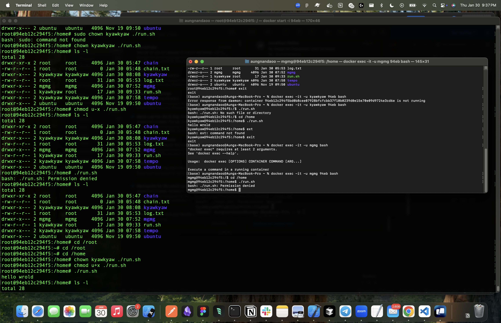

# Playing around with Linux 🐧 & Docker 🐳 CLI 



## building img
docker build -t app_name .

## running docker img
docker run -it app_name sh

## install
docker pull ubuntu or docker run ubuntu

## check if running status
docker ps

## check if pulled is success
docker ps -a

## run the img 
docker run -it ubuntu

## update the list
apt update

## get the list
apt list

## install or remove
apt install or remove nano

## inspection of docker file
docker inspect nikkiaung/aiintegratedcoffeeshopapp3:latest

## failed to pull image: no matching manifest for linux/amd64 in the manifest list entries, worker is ready
docker buildx build --platform linux/amd64,linux/arm64 -t nikkiaung/aiintegratedcoffeeshopapp3:latest --push .

## docker login and use generate token
docker login -u nikkiaung

## find hidden files
find -type d
find -type f

## To find with file name
find -type f -name "h*" or "*.txt"

## To search across multiple files or a directory, you can use:
grep "search_term" *.txt or filename.txt

## Or to search recursively through directories:
grep -r "search_term" /path/to/directory

## interesting linix CLI
 ";" is for multi CLI
 "&&", "||", ls | sorted -r "|" is for result making

## To Create User
useradd -m mgmg

## Check the created pfp
cat /etc/passwd

## checked as admin
cat /etc/shadow

## modify
usermod -s /bin/bash/ mgmg

## del
userdel -f filename

## entering wth created user 
docker exec -it -u kyawkyaw _id_ bash

## creating GP
groupadd internship

## check gp
groups user_name

## adding someone to gp
usermod -G group_name user_name

## Permission explanation 
#### [ File Type ] [ Owner ] [ Group ] [ Others ]
-rwxr--r-x

## **Note** Diff between CMD & ENTRY POINT
CMD is used for default CL, can override while
ENTRY POINT force the CL


## LAYER VERY IMPORT IN DOCKER
COPY package*.json . -> monitoring the changes json
```bash
if *.json chages:
    RUN npm install (reinstall)
else:
    Use from cache
```
## View all docker images.
docker images

## removing all dangling images
docker image prune

## View all container images.
docker ps

## Removing unused conatainer
docker container prune

## Remove wth specific id
docker image rm _id_

## Tagging an image when building.
docker built -t image_name:tag

## Removing image tag.
docker image remove image_name:tag

## Tagging an image after building.
docker image tag _latest_id_ image_name:tag

## Tagging user_name before pushing to dockerhub
docker image tag image_name:tag user_name/react-app:tag

## Pushing to dockerhub
docker push user_name/react-app:tag

## Pulling
docker pull

## Run in Background
docker run -d image

## Naming containers
docker run -d --name container_name image

## Logging
docker logs container_id

## Logging ( watch mode )
docker logs -f container_id

# Publishing PORT

## In dockerFile
EXPOSE ur_port

## Redirecting port to our host
docker run -d -p 5000:8080 image

## Wanna add name
docker run -d -p 5000:8080 --name container_name image

## Executing cmd to existing running container
docker exec container_id or container_name

## Can also try this
docker exec -it container_id or container_name sh

## Manually start/stop container
docker start container_id or container_name 
docker stop container_id or container_name

## Removing container ( force )
docker rm -f container_id or container_name

## To build simliar file inside docker container
docker run -d -v shared_data:/app/data app_name

## To inspect the data
docker inspect shared_data

## Binding Host & Container
docker run -p host_port:container_port -v ${PWD}:/app -v /app/node_modules -e CHOKIDAR_USEPOLLING=true image_name